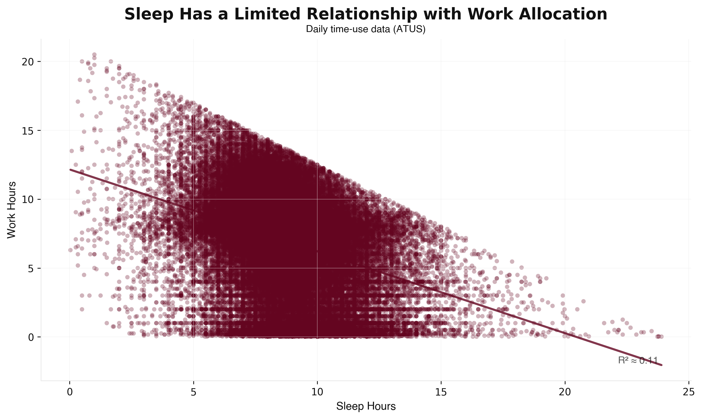
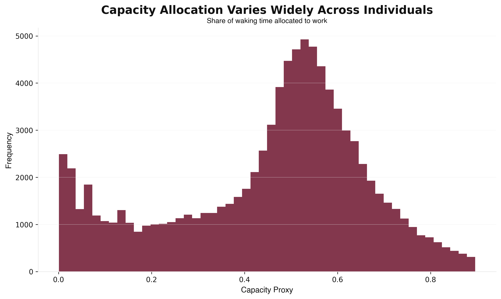
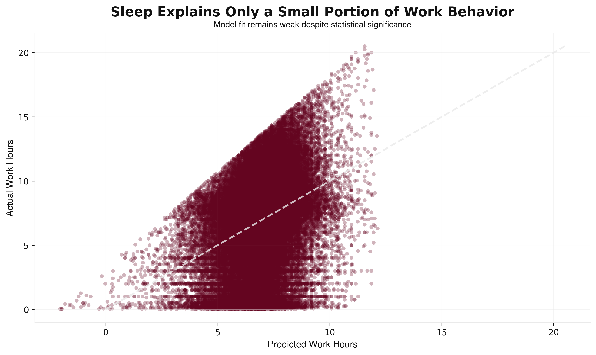

# Modeling Human Capacity: Does Sleep Explain Work Behavior?

> A micro-level analysis of whether biological constraints explain how people allocate work time.

## Overview

Most models of human productivity assume that biological factors like sleep strongly determine how people allocate work time.

This project tests that assumption using American Time Use Survey (ATUS) data, examining whether sleep meaningfully explains variation in work behavior.

## Key Insight

**Sleep influences work behavior, but explains only a small portion of variation in how people allocate time to work.**

## Why This Matters

Many models of human productivity assume biological factors like sleep strongly determine capacity and output. If this assumption does not hold, simple time-based models are insufficient for understanding or predicting human behavior. Understanding the limits of these variables is critical for building better systems, whether in workforce planning, productivity tools, or research design.

## Data

- **Source**: American Time Use Survey (ATUS)
- **Unit**: Daily time allocation per individual
- **Sample**: 93,019 active workers (work_hours > 0)
- **Key variables**:
  - `work_hours`: Daily hours spent on work tasks
  - `sleep_hours`: Daily hours of sleep
  - `waking_hours`: 24 - sleep_hours
  - `capacity_proxy`: work_hours / waking_hours (share of waking time allocated to work)

## Methods

- Feature construction (capacity proxy from sleep and work hours)
- Correlation analysis (Pearson and Spearman)
- Regression modeling (sleep-only, sleep + threshold, nonlinear specifications)
- Threshold analysis (sleep < 7 hours vs ≥ 7 hours)
- Robustness checks (excluding extreme sleepers)

## Key Findings

- Sleep is statistically significant but weak in explaining work behavior (R² ≈ 0.11)
- Individuals who sleep less tend to work more, but the effect is modest (coefficient: -0.59 hours of work per additional hour of sleep)
- Threshold effects exist but are small (sleep < 7 hours is associated with modest differences in work allocation)
- Most variation in work behavior remains unexplained

> Simple time and biological variables explain only a limited portion of how people allocate work.

## Visualizations

*Sleep has a limited relationship with work allocation (R² ≈ 0.11)*

*Capacity allocation varies widely across individuals*

*Model fit remains weak despite statistical significance*

## Interpretation

This analysis does NOT measure productivity. It models time allocation under constraints—specifically, how people divide their available waking time between work and other activities. Results highlight the limits of simple explanatory variables like sleep hours.

These results highlight the gap between observable constraints and actual behavior.

## Limitations

- `capacity_proxy` is a constructed measure, not a direct measure of productivity
- Cross-sectional data limits causal interpretation
- Unobserved factors (preferences, constraints, health, environment) likely drive most variation
- Results reflect population-level patterns, not individual behavior over time

## Implications

- Time and sleep alone provide limited explanatory power for human behavior
- Work allocation is influenced by more complex and unobserved factors
- Models based solely on time or biological inputs will systematically underperform
- Effective systems must incorporate multiple interacting factors rather than relying on single-variable explanations

## Next Step

> These results motivate the need for simulation-based models that incorporate multiple interacting factors rather than relying on single-variable explanations.
